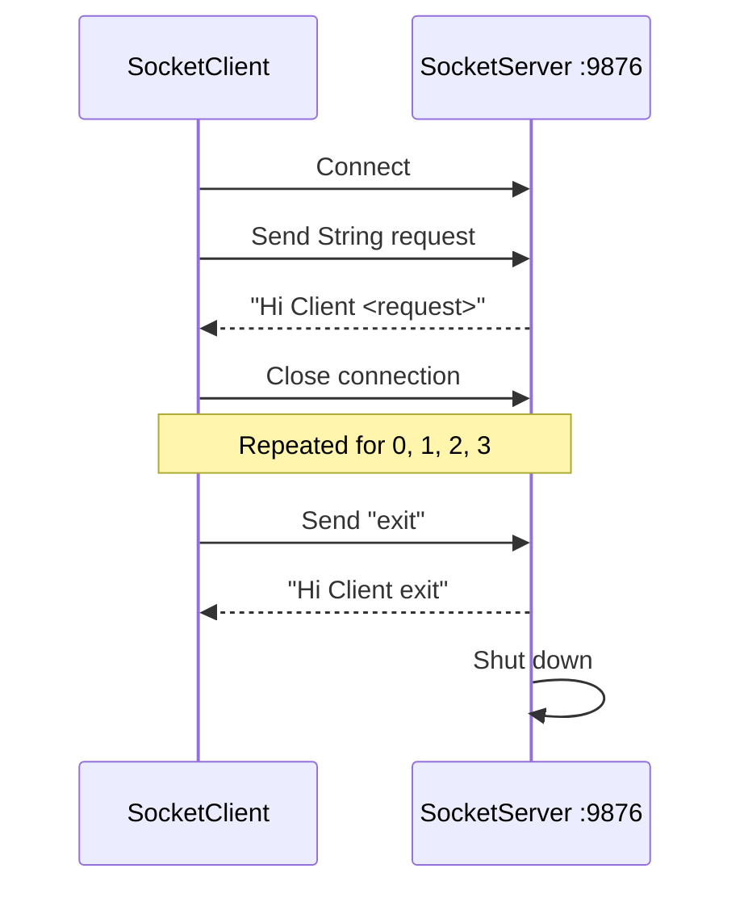

# Java Socket Client-Server Lab

A small Java networking project that demonstrates the basic workflow of a **client-server architecture using TCP sockets**.

The server listens on port `9876`, accepts client connections, reads a serialized `String`, sends a response, and shuts down when it receives `exit`. The client opens a connection for each request, sends `0`, `1`, `2`, `3`, and finally `exit`.

## Learning objectives

This lab is intended to demonstrate:

- how a Java `ServerSocket` listens for incoming connections;
- how a Java `Socket` connects a client to a server;
- how a port identifies the application receiving TCP traffic;
- how `ObjectInputStream` and `ObjectOutputStream` exchange Java objects;
- how a simple request-response protocol works;
- how a client can send a termination command to stop the server.

## Architecture



## Project structure

```text
java-socket-client-server-lab/
├── src/
│   ├── SocketServer.java
│   └── SocketClient.java
├── docs/
│   └── lab2report.docx
├── .gitignore
└── README.md
```

## Requirements

- Java Development Kit (**JDK 8+**)
- A terminal, command prompt, or Java IDE

Check your Java installation:

```bash
java -version
javac -version
```

## Run the project

### 1. Compile

From the repository root:

```bash
javac src/SocketServer.java src/SocketClient.java
```

### 2. Start the server

Open the first terminal:

```bash
java -cp src SocketServer
```

The server should display:

```text
Waiting for the client request
```

### 3. Start the client

Open a second terminal:

```bash
java -cp src SocketClient
```

The client connects to the server and sends five requests.

## Expected output

### Server

```text
Waiting for the client request
Message Received: 0
Waiting for the client request
Message Received: 1
Waiting for the client request
Message Received: 2
Waiting for the client request
Message Received: 3
Waiting for the client request
Message Received: exit
Shutting down Socket server!!
```

### Client

```text
Sending request to Socket Server
Message: Hi Client 0
Sending request to Socket Server
Message: Hi Client 1
Sending request to Socket Server
Message: Hi Client 2
Sending request to Socket Server
Message: Hi Client 3
Sending request to Socket Server
Message: Hi Client exit
```

## How it works

1. `SocketServer` creates a `ServerSocket` bound to port `9876`.
2. The server waits at `accept()` until a client connects.
3. `SocketClient` connects to the server using a TCP socket.
4. The client serializes and sends a `String` request.
5. The server reads the request and replies with `Hi Client <request>`.
6. The connection closes after each request.
7. When the server receives `exit`, it sends the final response and terminates.

## Key classes

| Java class | Purpose |
|---|---|
| `ServerSocket` | Listens for incoming TCP client connections |
| `Socket` | Represents one endpoint of a TCP connection |
| `ObjectInputStream` | Reads serialized Java objects from the socket |
| `ObjectOutputStream` | Writes serialized Java objects to the socket |
| `InetAddress` | Resolves the host address used by the client |


## Author

**Bernard Godonou**  

